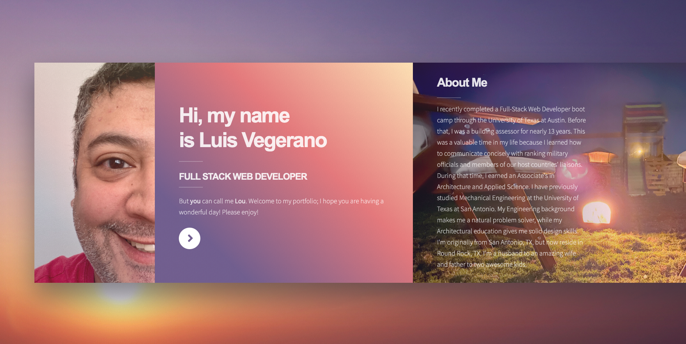

# Portfolio

# Live Link
[Portfolio](https://louportfolio.herokuapp.com/portfolio.html)
# Description
This portfolio was a modified version of an [HTML5 Up](https://html5up.net/) template called Ethereal.  I changed a lot of the CSS in both small and large ways.  This was an extremely cool challenge in that I had no documentation to go off of but also wasn't starting from scratch.  HTML5 Up is cool because anyone can download their code but only experienced web developers can actually take it from a few files to an actual live site.  My portfolio displays both projects that I am proud of but also the skills used in those projects and this portfolio as well.
# Projects and Skills
## Projects
* Nomster
* Lou Vegerano Blog
* Flixter
* Splurty
* To Do
* JavaScript Clock
* JavaScript Drum Machine
* JavaScript CSS Variable Update
* Mello

## Skills
* Ruby
* Rails
* Git
* Github
* Heroku
* AWS
* Google API
* JavaScript
* React JS
* HTML5
* CSS3
